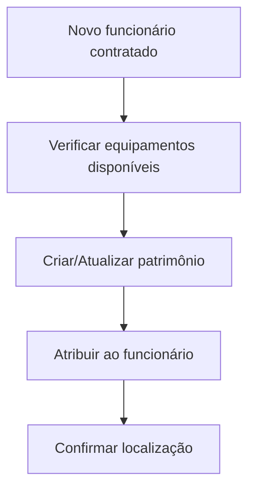
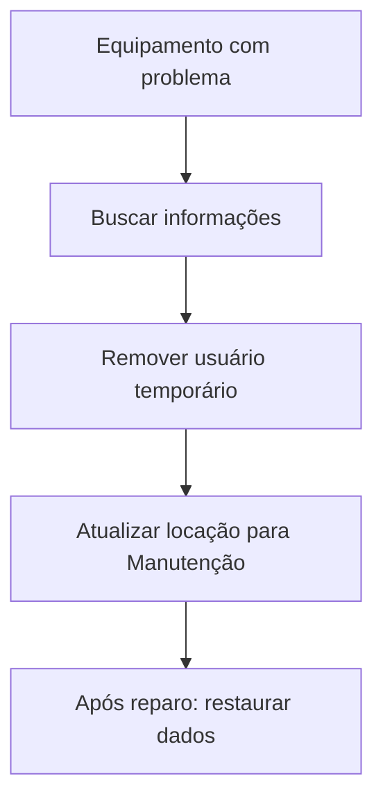
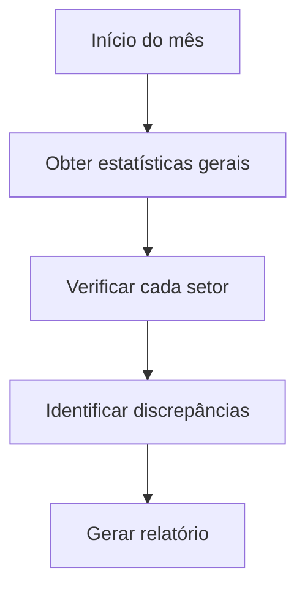

# Exemplos de Uso - MCP Patrimônio

Este guia apresenta exemplos práticos e casos de uso reais do servidor MCP Patrimônio para gestão de patrimônio.

## 📋 Índice

- [Casos de Uso Básicos](#casos-de-uso-básicos)
- [Casos de Uso Avançados](#casos-de-uso-avançados)
- [Fluxos de Trabalho](#fluxos-de-trabalho)
- [Integrações](#integrações)
- [Exemplos com Claude](#exemplos-com-claude)
- [Exemplos Programáticos](#exemplos-programáticos)

## 🎯 Casos de Uso Básicos

### 1. Consultar Patrimônio Específico

**Cenário**: Você precisa obter informações detalhadas de um equipamento.

**Com Claude Desktop**:
```
Busque as informações do patrimônio PAT-001
```

**Ferramenta Chamada**: `neviim_get_patrimonio`

**Parâmetros**:
```json
{
  "numero": "PAT-001"
}
```

**Resposta Esperada**:
```json
{
  "id": "507f1f77bcf86cd799439011",
  "numero": "PAT-001",
  "setor": "TI",
  "usuario": "João Silva",
  "tipoEquipamento": "Notebook",
  "locacao": "Sala 101",
  "descricao": "Dell Latitude 5520 - 16GB RAM, 512GB SSD",
  "valor": 3500.00,
  "dataAquisicao": "2024-01-15"
}
```

**Caso de Uso Real**:
- Auditoria de equipamentos
- Verificação rápida de localização
- Conferência de dados antes de manutenção

---

### 2. Listar Equipamentos de um Setor

**Cenário**: O gerente de TI quer ver todos os equipamentos do seu setor.

**Com Claude Desktop**:
```
Liste todos os patrimônios do setor de TI
```

**Ferramenta Chamada**: `neviim_get_patrimonios_por_setor`

**Parâmetros**:
```json
{
  "setor": "TI"
}
```

**Resposta**: Array com todos os equipamentos do setor TI.

**Caso de Uso Real**:
- Inventário departamental
- Planejamento de upgrades
- Controle de ativos por área

---

### 3. Ver Equipamentos de um Usuário

**Cenário**: Colaborador mudou de setor, precisa devolver equipamentos.

**Com Claude Desktop**:
```
Quais equipamentos estão com o usuário Maria Santos?
```

**Ferramenta Chamada**: `neviim_get_patrimonios_por_usuario`

**Parâmetros**:
```json
{
  "usuario": "Maria Santos"
}
```

**Caso de Uso Real**:
- Devolução de equipamentos
- Transferência de colaborador
- Responsabilização de ativos

---

### 4. Criar Novo Patrimônio

**Cenário**: Chegou um novo equipamento que precisa ser cadastrado.

**Com Claude Desktop**:
```
Cadastre um novo patrimônio com os seguintes dados:
- Número: PAT-150
- Setor: RH
- Usuário: Ana Paula
- Tipo: Desktop
- Locação: Sala 205
- Descrição: HP EliteDesk 800 G6
- Valor: R$ 2.800,00
- Data de aquisição: 06/10/2024
```

**Ferramenta Chamada**: `neviim_create_patrimonio`

**Parâmetros**:
```json
{
  "data": {
    "numero": "PAT-150",
    "setor": "RH",
    "usuario": "Ana Paula",
    "tipoEquipamento": "Desktop",
    "locacao": "Sala 205",
    "descricao": "HP EliteDesk 800 G6",
    "valor": 2800.00,
    "dataAquisicao": "2024-10-06"
  }
}
```

**Resposta**: Patrimônio criado com ID gerado.

**Caso de Uso Real**:
- Entrada de novos equipamentos
- Registro de compras
- Expansão de infraestrutura

---

### 5. Atualizar Patrimônio

**Cenário**: Equipamento foi transferido para outro usuário.

**Com Claude Desktop**:
```
Atualize o patrimônio de ID 507f1f77bcf86cd799439011,
transferindo para o usuário Pedro Costa na Sala 103
```

**Ferramenta Chamada**: `neviim_update_patrimonio`

**Parâmetros**:
```json
{
  "id": "507f1f77bcf86cd799439011",
  "data": {
    "usuario": "Pedro Costa",
    "locacao": "Sala 103"
  }
}
```

**Caso de Uso Real**:
- Movimentação de equipamentos
- Atualização de responsável
- Mudança de localização

---

### 6. Obter Estatísticas

**Cenário**: Diretor quer um panorama geral dos ativos.

**Com Claude Desktop**:
```
Mostre as estatísticas gerais dos patrimônios
```

**Ferramenta Chamada**: `neviim_get_estatisticas`

**Parâmetros**:
```json
{}
```

**Resposta**:
```json
{
  "total": 150,
  "porSetor": {
    "TI": 45,
    "RH": 20,
    "Financeiro": 35,
    "Operações": 50
  },
  "porTipoEquipamento": {
    "Notebook": 60,
    "Desktop": 50,
    "Monitor": 40
  },
  "porLocacao": {
    "Sala 101": 10,
    "Sala 102": 8,
    "Sala 103": 12
  },
  "valorTotal": 425000.00
}
```

**Caso de Uso Real**:
- Relatórios gerenciais
- Planejamento orçamentário
- Análise de distribuição de ativos

---

## 🚀 Casos de Uso Avançados

### 1. Auditoria Completa de Setor

**Cenário**: Auditoria trimestral do setor de TI.

**Conversa com Claude**:
```
1. Liste todos os equipamentos do setor TI
2. Para cada equipamento, me mostre o valor
3. Some o valor total
4. Me diga quantos notebooks vs desktops existem
```

**Ferramentas Usadas**:
1. `neviim_get_patrimonios_por_setor` → Lista equipamentos
2. Claude processa os dados
3. Claude calcula valores e quantidades

**Resultado**: Relatório completo com valor total e distribuição.

---

### 2. Transferência de Colaborador

**Cenário**: Maria está deixando o RH e indo para Financeiro.

**Conversa com Claude**:
```
1. Quais equipamentos estão com Maria Santos?
2. Atualize o setor de todos esses equipamentos para "Financeiro"
3. Atualize a locação para "Sala 301"
```

**Ferramentas Usadas**:
1. `neviim_get_patrimonios_por_usuario` → Lista equipamentos de Maria
2. `neviim_update_patrimonio` → Para cada equipamento (múltiplas chamadas)

**Resultado**: Todos os equipamentos atualizados.

---

### 3. Planejamento de Renovação

**Cenário**: Identificar equipamentos antigos para substituição.

**Conversa com Claude**:
```
1. Liste todos os notebooks do setor TI
2. Identifique quais foram adquiridos antes de 2022
3. Calcule o custo estimado de renovação (R$ 4.000 por notebook)
```

**Ferramentas Usadas**:
1. `neviim_get_patrimonios_por_setor` → Lista TI
2. Claude filtra por tipo e data
3. Claude calcula custo

**Resultado**: Lista de equipamentos + custo estimado de renovação.

---

### 4. Reconciliação de Inventário

**Cenário**: Conferir se todos os equipamentos de uma sala estão registrados.

**Conversa com Claude**:
```
1. Mostre todos os equipamentos da Sala 101
2. Para cada um, confirme que o usuário está correto
```

**Ferramentas Usadas**:
1. `neviim_get_estatisticas` → Ver locações
2. Múltiplas chamadas `neviim_get_patrimonio_por_id`

---

### 5. Relatório de Valor por Setor

**Cenário**: CFO quer saber quanto cada setor possui em ativos.

**Conversa com Claude**:
```
Para cada setor, me diga:
1. Quantos equipamentos possui
2. Valor total dos equipamentos
3. Valor médio por equipamento
```

**Ferramentas Usadas**:
1. `neviim_get_estatisticas` → Visão geral
2. `neviim_get_patrimonios_por_setor` → Para cada setor
3. Claude calcula médias e totais

**Resultado**: Tabela com análise financeira por setor.

---

## 🔄 Fluxos de Trabalho

### Fluxo 1: Entrada de Novo Funcionário



**Comandos**:
```
1. "Liste equipamentos do setor RH sem usuário definido"
2. "Atualize o patrimônio PAT-045, atribuindo ao usuário Carlos Mendes"
3. "Confirme a locação do PAT-045 na Sala 201"
```

---

### Fluxo 2: Manutenção de Equipamento



**Comandos**:
```
1. "Busque informações do PAT-023"
2. "Atualize PAT-023: usuario='Em Manutenção', locacao='Oficina'"
3. [Após reparo]
4. "Atualize PAT-023: usuario='João Silva', locacao='Sala 101'"
```

---

### Fluxo 3: Inventário Mensal



**Comandos**:
```
1. "Mostre as estatísticas gerais"
2. "Liste equipamentos do setor TI"
3. "Liste equipamentos do setor RH"
4. "Compare com o inventário anterior e identifique diferenças"
```

---

## 🔗 Integrações

### Integração 1: Com Sistema de Tickets

**Cenário**: Quando um ticket de manutenção é aberto, buscar informações do equipamento.

**Pseudo-código**:
```javascript
// Evento: Novo ticket criado
async function onTicketCreated(ticket) {
  const patrimonioNumero = ticket.equipmentId;

  // Chamar ferramenta via MCP
  const info = await mcpClient.callTool('neviim_get_patrimonio', {
    numero: patrimonioNumero
  });

  // Anexar informações ao ticket
  ticket.addInfo({
    usuario: info.usuario,
    locacao: info.locacao,
    descricao: info.descricao
  });
}
```

---

### Integração 2: Com Sistema de RH

**Cenário**: Quando funcionário é desligado, listar equipamentos para devolução.

**Pseudo-código**:
```javascript
// Evento: Funcionário desligado
async function onEmployeeTermination(employee) {
  // Listar equipamentos do funcionário
  const equipments = await mcpClient.callTool('neviim_get_patrimonios_por_usuario', {
    usuario: employee.name
  });

  // Criar checklist de devolução
  return {
    employee: employee.name,
    itemsToReturn: equipments.map(e => ({
      numero: e.numero,
      tipo: e.tipoEquipamento,
      locacao: e.locacao
    }))
  };
}
```

---

### Integração 3: Dashboard de Gestão

**Cenário**: Dashboard web que mostra estatísticas em tempo real.

**Exemplo React**:
```jsx
import { useMCP } from '@modelcontextprotocol/react';

function DashboardWidget() {
  const { callTool } = useMCP();
  const [stats, setStats] = useState(null);

  useEffect(() => {
    async function loadStats() {
      const result = await callTool('neviim_get_estatisticas', {});
      setStats(JSON.parse(result.content[0].text));
    }
    loadStats();
  }, []);

  return (
    <div>
      <h2>Total de Equipamentos: {stats?.total}</h2>
      <PieChart data={stats?.porSetor} />
    </div>
  );
}
```

---

## 💬 Exemplos com Claude

### Exemplo 1: Consulta Simples

**Usuário**:
> Me mostre as informações do patrimônio PAT-001

**Claude responde**:
> Vou buscar as informações do patrimônio PAT-001 para você.
>
> [Chama neviim_get_patrimonio]
>
> Aqui estão as informações:
> - **Número**: PAT-001
> - **Equipamento**: Notebook Dell Latitude 5520
> - **Usuário**: João Silva
> - **Setor**: TI
> - **Localização**: Sala 101
> - **Valor**: R$ 3.500,00
> - **Adquirido em**: 15/01/2024

---

### Exemplo 2: Análise Complexa

**Usuário**:
> Quantos notebooks temos no setor de TI e qual o valor total?

**Claude responde**:
> Vou buscar os equipamentos do setor TI e analisar para você.
>
> [Chama neviim_get_patrimonios_por_setor]
>
> Análise do setor de TI:
> - **Total de equipamentos**: 45
> - **Notebooks**: 28 unidades
> - **Valor total em notebooks**: R$ 98.000,00
> - **Valor médio por notebook**: R$ 3.500,00

---

### Exemplo 3: Operação de Update

**Usuário**:
> O notebook PAT-001 foi transferido para a Maria Santos na sala 205

**Claude responde**:
> Vou atualizar o registro do patrimônio PAT-001.
>
> [Chama neviim_get_patrimonio para obter ID]
> [Chama neviim_update_patrimonio]
>
> ✅ Patrimônio atualizado com sucesso!
> - **Novo usuário**: Maria Santos
> - **Nova localização**: Sala 205

---

### Exemplo 4: Fluxo Multi-etapas

**Usuário**:
> Preciso preparar um relatório de todos os desktops do financeiro com seus valores

**Claude responde**:
> Vou preparar esse relatório para você.
>
> [Chama neviim_get_patrimonios_por_setor com "Financeiro"]
>
> **Relatório de Desktops - Setor Financeiro**
>
> | Número | Usuário | Valor | Localização |
> |--------|---------|-------|-------------|
> | PAT-010 | Carlos Lima | R$ 2.500,00 | Sala 301 |
> | PAT-015 | Ana Costa | R$ 2.800,00 | Sala 302 |
> | PAT-022 | Pedro Souza | R$ 3.000,00 | Sala 303 |
>
> **Total**: 3 desktops
> **Valor total**: R$ 8.300,00

---

## 💻 Exemplos Programáticos

### Exemplo 1: Cliente Node.js

```javascript
import { Client } from '@modelcontextprotocol/sdk/client/index.js';
import { StdioClientTransport } from '@modelcontextprotocol/sdk/client/stdio.js';

async function main() {
  // Criar transport
  const transport = new StdioClientTransport({
    command: 'node',
    args: ['./dist/index.js'],
    env: {
      PATRIMONIO_BASE_URL: 'https://api.example.com',
      PATRIMONIO_TOKEN: 'token123',
    },
  });

  // Criar cliente
  const client = new Client({
    name: 'patrimonio-client',
    version: '1.0.0',
  }, {
    capabilities: {},
  });

  // Conectar
  await client.connect(transport);

  // Listar ferramentas
  const tools = await client.listTools();
  console.log('Ferramentas disponíveis:', tools);

  // Chamar ferramenta
  const result = await client.callTool('neviim_get_patrimonio', {
    numero: 'PAT-001',
  });

  console.log('Resultado:', JSON.parse(result.content[0].text));

  // Fechar
  await client.close();
}

main();
```

---

### Exemplo 2: Script de Backup

```javascript
// backup-patrimonios.js
import fs from 'fs';

async function backupPatrimonios(mcpClient) {
  // Obter estatísticas para saber os setores
  const stats = await mcpClient.callTool('neviim_get_estatisticas', {});
  const setores = Object.keys(JSON.parse(stats.content[0].text).porSetor);

  const backup = {
    timestamp: new Date().toISOString(),
    data: {},
  };

  // Para cada setor, buscar patrimônios
  for (const setor of setores) {
    const result = await mcpClient.callTool('neviim_get_patrimonios_por_setor', {
      setor,
    });
    backup.data[setor] = JSON.parse(result.content[0].text);
  }

  // Salvar backup
  fs.writeFileSync(
    `backup-${Date.now()}.json`,
    JSON.stringify(backup, null, 2)
  );

  console.log('Backup concluído!');
}
```

---

### Exemplo 3: Monitor de Mudanças

```javascript
// monitor.js
async function monitorPatrimonio(mcpClient, numero, interval = 60000) {
  let lastState = null;

  setInterval(async () => {
    const result = await mcpClient.callTool('neviim_get_patrimonio', {
      numero,
    });

    const currentState = JSON.parse(result.content[0].text);

    if (lastState && JSON.stringify(lastState) !== JSON.stringify(currentState)) {
      console.log('⚠️ Mudança detectada em', numero);
      console.log('Antes:', lastState);
      console.log('Depois:', currentState);

      // Notificar via webhook, email, etc
    }

    lastState = currentState;
  }, interval);
}

// Monitorar PAT-001 a cada minuto
monitorPatrimonio(client, 'PAT-001', 60000);
```

---

### Exemplo 4: Migração de Dados

```javascript
// migrate.js
async function migrateFromCSV(mcpClient, csvPath) {
  const records = parseCSV(csvPath); // Função hipotética

  for (const record of records) {
    try {
      const result = await mcpClient.callTool('neviim_create_patrimonio', {
        data: {
          numero: record.numero,
          setor: record.setor,
          usuario: record.usuario,
          tipoEquipamento: record.tipo,
          locacao: record.locacao,
          valor: parseFloat(record.valor),
          dataAquisicao: record.data,
        },
      });

      console.log('✅ Criado:', record.numero);
    } catch (error) {
      console.error('❌ Erro em', record.numero, error);
    }
  }

  console.log('Migração concluída!');
}
```

---

## 🎓 Boas Práticas

### 1. Sempre Valide Antes de Atualizar

```javascript
// ❌ Ruim
await mcpClient.callTool('neviim_update_patrimonio', {
  id: someId,
  data: { usuario: newUser },
});

// ✅ Bom
const current = await mcpClient.callTool('neviim_get_patrimonio_por_id', {
  id: someId,
});

if (current) {
  await mcpClient.callTool('neviim_update_patrimonio', {
    id: someId,
    data: { usuario: newUser },
  });
}
```

### 2. Use Estatísticas para Visões Gerais

```javascript
// ❌ Ruim: Buscar cada setor individualmente
const setores = ['TI', 'RH', 'Financeiro'];
for (const setor of setores) {
  await mcpClient.callTool('neviim_get_patrimonios_por_setor', { setor });
}

// ✅ Bom: Uma chamada para visão geral
const stats = await mcpClient.callTool('neviim_get_estatisticas', {});
```

### 3. Trate Erros Apropriadamente

```javascript
try {
  const result = await mcpClient.callTool('neviim_get_patrimonio', {
    numero: 'PAT-999',
  });
  // ...
} catch (error) {
  if (error.message.includes('404')) {
    console.log('Patrimônio não encontrado');
  } else if (error.message.includes('401')) {
    console.log('Token inválido - verifique configuração');
  } else {
    console.error('Erro desconhecido:', error);
  }
}
```

---

## 🔍 Troubleshooting de Exemplos

### Problema: "Patrimônio não encontrado"

Verifique se o número está correto:
```javascript
// Tente buscar por ID em vez de número
const result = await mcpClient.callTool('neviim_get_patrimonio_por_id', {
  id: patrimonioId,
});
```

### Problema: "Validation error"

Verifique os campos obrigatórios:
```javascript
// ✅ Todos os campos obrigatórios presentes
const data = {
  numero: 'PAT-123',      // ✅
  setor: 'TI',            // ✅
  usuario: 'João',        // ✅
  tipoEquipamento: 'PC',  // ✅
  locacao: 'Sala 101',    // ✅
};
```

---

**Documentação de Exemplos Completa**

Para referência técnica detalhada, veja [API.md](API.md)
